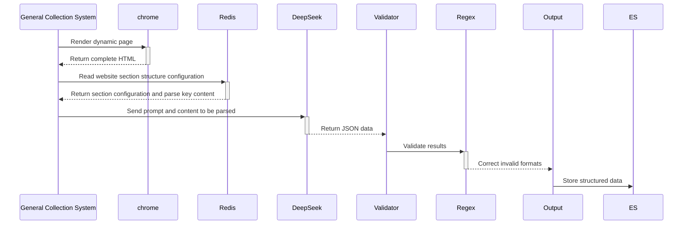

+++
date = '2025-08-13'
draft = false
title = 'Integration of LLM and Traditional Parsing Technologies: Evolution and Best Practices in Web Data Extraction'
description = "Based on our company’s years of industry experience and technical implementation practices in public opinion monitoring and web data mining & analysis, this article explores the progression and paradigm shift of web parsing technologies from rule-driven to semantic understanding. It analyzes the revolutionary value and inherent limitations of LLMs for data extraction, and proposes a hybrid architecture solution."
categories = [
    "互联网信息挖掘分析",
]
tags = [
    "Public Opinion Monitoring",
    "Web Data Mining & Analysis",
    "Web Parsing Technology",
    "LLM Applications"
]
+++

# Integration of LLM and Traditional Parsing Technologies: Evolution and Best Practices in Web Data Extraction

​                               Zhang Zibiao | Zhengzhou Shuneng Software Technology Co., Ltd. | China

---

## 1. Traditional Parsing Technologies: The Era of Rules and Statistics

### 1.1 Evolution of Core Methods
| **Period** | **Representative Technologies**        | **Working Principle**                         | **Typical Tools**          |
| ---------- | --------------------------------------- | ---------------------------------------------- | --------------------------- |
| Rule-based | Regular Expressions / XPath / CSS Selector | Manually written pattern matching rules        | `BeautifulSoup`, `Scrapy`   |
| Statistical| CRF / HMM Sequence Labeling             | Learn entity recognition probability models from labeled data | `Stanford NER`, `CRF++`     |
| Visual Parsing | OCR + Text Position Recognition via Page Rendering | Render page screenshots and recognize text positions | `Selenium` + `Tesseract`    |

### 1.2 Drawbacks of Traditional Parsing
```python
# Example: CSS extraction of website source info - breaks if the website layout changes
price = response.xpath('//span[@class="source"]/text()').get()
```

- **Poor generalization**: Minor page structure changes cause rules to fail  
- **Lack of semantic understanding**: Can only extract explicit fields (e.g., price), cannot summarize product descriptions  
- **Manual configuration**: Requires manual configuration for each website section’s structure  
- **Complex attribute extraction**: Weakly structured attributes (e.g., source/document numbers) are difficult to accurately extract via configuration

---

### 1.3 Advantages and Suitable Scenarios for Traditional Parsing

- **High processing efficiency**: Operates on local structured character parsing, very efficient  
- **Suitable for highly structured content**: For example, titles, list pages, and extracting main text fragments can be done well with simple configuration  
- **Parsing optimization**: By configuring CSS expressions properly, small changes in web structure can be adapted to. For example:  

  ```java
  // Here, span > li is too strict. If another tag (e.g., <div>, <em>, etc.) is inserted between span and li, it won’t match.
  div[class="zsy_conlist"] > ul > span > li > a
  // Change to descendant selector (space)
  div[class="zsy_conlist"] > ul > span li a
  // This way, regardless of how many layers are inserted between span and li, it can still match. Adapts to small page structure changes
  ```

## 2. LLM Parsing: The Semantic Understanding Revolution

### 2.1 Core Advantages of LLM
```markdown
[Input] HTML code (including ads/irrelevant tags)  
[LLM Instruction] Extract contact email and summarize main business  
[Output]  
{
  "email": "contact@realestate.com",
  "business": "Specialized in internet information collection and data processing solutions"
}
```
- **Breaks structural dependency**: Directly understands page semantics  
- **Handles complex tasks**: Entity extraction + summary generation + custom phrasing in one step  
- **Anti-interference capability**: Ignores frontend obfuscation (e.g., dynamic class names)  

### 2.2 Four Accuracy Issues of LLM
| **Problem Type** | **Example**                          | **Root Cause**               |
| ---------------- | ------------------------------------ | ----------------------------- |
| Probabilistic bias | Phone `138-0013-8000` → `13800138000` | Seeks semantic plausibility over exact matching |
| Context truncation | Loss of information at the end of long pages | Window size limits (e.g., DeepSeek 64K) |
| Fails under adversarial interference | Unable to recognize phone numbers in images | Limitations of text-only models |
| Slower processing | Slower extraction of specific content | Network and model performance limitations |

---

## 3. Hybrid Parsing Architecture: Balancing Accuracy and Generalization

### 3.1 Technical Integration Design Scheme


### 3.2 Key Implementation Strategies
#### Strategy 1: **Strong Constraints on LLM Output**
```prompt
Strictly output in JSON format:
{
  "name": "string or null",
  "phone": "Must match ^\d{3}-\d{4}-\d{4}$",
  "business": "Summary no longer than 20 characters"
}
Do not fabricate non-existent information!
```

#### Strategy 2: **Fallback to Traditional Rules**
```python
def validate_phone(phone):
    import re
    pattern = r'^\d{3}-\d{4}-\d{4}$'  # Strong format validation
    return bool(re.match(pattern, phone)) if phone else False
```

#### Strategy 3: **Dynamic Chunk Processing**
```python
# Solve long page context overflow
from bs4 import BeautifulSoup

def chunk_html(html, max_tokens=2000):
    soup = BeautifulSoup(html, 'html.parser')
    chunks = []
    current_chunk = ""
    for section in soup.find_all('section'):  # Split by semantic blocks
        if len(current_chunk) + len(section.text) > max_tokens:
            chunks.append(current_chunk)
            current_chunk = section.text
        else:
            current_chunk += section.text
    return chunks
```

### 3.3 Performance Comparison (Policy and Regulation Information Parsing Scenario)
| **Solution**      | Policy-Specific Attribute Accuracy | Main Text Accuracy | Cost/1K Pages | Layout Adaptability |
| ----------------- | ---------------------------------- | ------------------ | ------------- | ------------------- |
| Pure Traditional Rules | 68%                            | 95%                | $0.01         | ❌                   |
| Pure LLM (DeepSeek) | 96%                              | 83%                | $0.15         | ✅                   |
| **Hybrid Architecture** | **98%**                       | **97%**            | **$0.08**     | ✅                   |

---

## 4. Practical Case: General Web Information Collection System

### 4.1 Technology Stack Components
| **Component** | **Recommended Tool**               | **Function**                     |
| ------------- | ---------------------------------- | --------------------------------- |
| Crawler Framework | Crawl-for-AI / selenium         | Webpage fetching                  |
| Dynamic Rendering | chrome-driver                   | Handle JS-loaded content          |
| LLM Parsing   | DeepSeek-V3 + glm:GLM-4-Flash       | Summary generation & attribute extraction |
| Rule Engine   | Custom Python validation library   | Key field format validation       |
| Proxy Service | Bright Data                        | IP rotation to avoid bans         |

### 4.2 Workflow


### 4.3 Benefit Analysis
- **Collection efficiency and accuracy**: Simple configuration for specific sites without worrying about follow-up processes; automated collection → business logic execution  
- **Semantic understanding and processing**: LLM generates summaries and extracts specific content attributes  
- **Cost control**: Hybrid solution reduces cost by 47% compared to pure LLM parsing  

---

## 5. Conclusion: Technical Selection Guide

### 5.1 Recommended Solution Matrix
| **Scenario**           | **Recommended Solution**      | **Reason**                                |
| ---------------------- | ----------------------------- | ----------------------------------------- |
| Government Gazette/API Data | Pure rule parsing (XPath, CSS) | Stable structure, near-zero cost          |
| E-commerce Price Monitoring | Rules + LLM Summary        | High-precision number extraction + activity description understanding |
| Business Directory Lead Generation | LLM-centric + Rule Validation | Adapts to diverse page styles, ensures key field accuracy |
| Dynamic Rendering SPA Applications | Playwright + LLM Chunk Processing | JS execution first, then long page segmented parsing |

### 5.2 Future Directions
1. **Multimodal Parsing Breakthroughs**: LLM + Vision to recognize phone numbers in images / CAPTCHAs  
2. **Self-Iterating Wrappers**: LLM automatically generates and maintains XPath rules  
3. **Lightweight Deployment**: 7B-scale model local operation (e.g., Llama 3 + ONNX)  

> **Ultimate Rules**:  
> - Key fields (phone/email) **must be validated by rules**  
> - Semantic tasks (summary/phrasing) **should be handled by LLM**  
> - Dynamic content **should be pre-rendered**  
> - Long pages **should be chunked and deduplicated**  

By combining **LLM’s semantic generalization capability** with **the determinism of traditional rules**, modern data extraction systems are achieving breakthroughs in both accuracy and adaptability.
