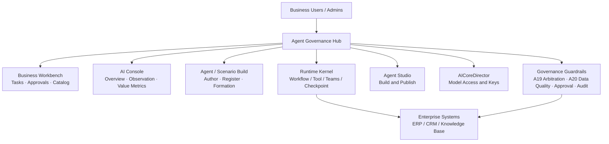

## Agent Governance Hub: An AI Agent Service and Control Platform for Enterprises and Public Institutions

**— Zhengzhou Shuneng Software's core infrastructure for building an enterprise AI ecosystem**

***

Agent Governance Hub is not another chatbot. It is an **AI agent service and control platform** for enterprises and public institutions: the core infrastructure on which an organization can build its AI ecosystem. Both the workbench and the console are for the whole workforce—people who do the work and people who control it share the same entry.

As the **orchestration and control hub** for enterprise AI capabilities, it brings multiple agents, business rules and human approvals into one workflow. The hard constraints are that every flow must be **orchestratable, governable and auditable**—so any operating action involving AI stays compliant, controllable and traceable. That is what lets AI embed into operations, management and production, expand across business scenarios, and keep the organization's overall AI capability evolving.

**Agent Governance Hub**, from Zhengzhou Shuneng Software Technology Co., Ltd. ("Shuneng"), is built to that brief.

***

## I. What Actually Blocks Agents Inside the Enterprise

Many organizations already "have AI": writing assistants here, a few orchestrated flows there, a model wired into quoting or support. The internal reality is often:

*   **Invisible**: nobody knows how many agents exist, what they own, or whether they are even on
*   **Uncontrolled**: assistants can push business actions without role-based approval or data-quality gates
*   **Untraceable**: after a run, it is hard to see which steps fired, which policy was used, and who approved
*   **Non-reusable**: prompts and SOPs live in project repos; the next plant or customer starts from zero
*   **Industry-locked**: an agent built for one factory is hard to move to another enterprise or sector

The root cause is not a weak model. It is that enterprises still consume agents as **chat products**, not as **business services**.

A chat box answers "can I ask". A business service must answer "can I request it, finish it, assign responsibility, and write the result back".

***

## II. Shuneng's Approach: Agents as Enterprise Services

Agent Governance Hub is an **AI agent service and control platform** for enterprises and public institutions, and the orchestration-and-control hub for enterprise AI capabilities. The workbench and console are for the whole workforce.

For business users it is a workbench: start a task in one sentence or from a catalog, track execution, handle approvals.  
For builders it is an assembly line: create agents in Studio, register or import them, and compose multiple agents, business rules and human approvals into one workflow.  
For operators it is a console: managed agents, live runs, human interventions, audit records; optionally switch the enterprise to analysis-only or emergency stop.

In one line:

> Orchestratable, governable, auditable: every AI-involved operating action must stay compliant, controllable and traceable.



The stack is deliberately split:

| Layer | Product | Owns | Does Not Own |
|---|---|---|---|
| Governance & Loop | Agent Governance Hub | Intent, catalog, formation, gates, approval, audit, write tokens | Never hands commit rights to the model |
| Intelligent Runtime | Runtime Kernel | Workflow, tools, retrieval, memory, evaluation | Never owns approval |
| Model Capability | AICoreDirector | Multi-model access and invocation | Never writes business systems directly |

Studio is the capability production line: after building, clicking publish can webhook the hub for auto-registration; definitions can also be imported from Dify and other tools, then hosted by the platform.

***

## III. How the Product Is Organized: Console, Workbench, Build

The interface is layered by real enterprise roles—not a single "AI chat page" with everything dumped together.

### 3.1 AI Console: See First, Then Govern

Overview, runtime observation, and value metrics. Managed agents, running tasks, risk/human intervention, audit records—all numbers come from actual platform records, not fabricated business data.

The console supports enterprise-wide modes: normal, analysis-only, and emergency stop. It can also start/stop business agents, scenarios, and scheduled tasks per enterprise tenant. Governance nodes A19 and A20 cannot be disabled—this is by design, not oversight.

Value metrics currently display provable governance operations indicators: governed task count, data-quality gate blocks, approval pass rate, Skill coverage, SLA on-time completion rate, and scenario usage distribution. Business ROI figures like cost savings and capacity gains must be calculated after connecting real business baselines—the platform will not invent returns without evidence.

### 3.2 Business Workbench: Do, Follow, Look Up

Ordered by business habit:

1.  **My Tasks**: left pane for ad-hoc tasks (including free-text initiation), right pane for scheduled plans
2.  **Pending for Me**: approvals and human checkpoints
3.  **Execution Trace**: flow diagram + logs + node details
4.  **Business Scenario Catalog**: published services for business users to initiate
5.  **Agent Assets**: read-only capability overview, not a build surface

A free-text task first goes through intent recognition, then matches against the published service catalog. A hit uses that scenario's formation, SLA, and approver. A miss is logged as an ad-hoc request and may still be orchestrated dynamically, but **the platform will not auto-create a new catalog item from a single sentence**. To formalize a service, you must publish a scenario in the build surface.

### 3.3 Agent / Scenario Build: From Capability to Service

The build path has three fixed steps:

1.  **Agent Studio**: embed Studio, draw and run the agent
2.  **Agent Registration / Import**: build directly on the platform, sync from Studio publish, or import from Dify/other tools
3.  **Assemble Scenario**: drag-and-drop formation, connect, publish; system auto-appends A19 / A20

With bridging enabled, clicking "Publish" in Studio webhooks the hub for auto-registration or update. Re-publishing after changes updates the ledger by the same source—no duplicate entry. Unpublishing marks the agent inactive while preserving historical traces.

***

## IV. The Governance Base: The Prerequisite for Using Agents in Critical Business

Agent Governance Hub applies a mature enterprise operating model to multi-agent collaboration: service catalog, request and execution orders, knowledge, approval and SLA, controlled integration, operational analytics. The runtime kernel handles suggestions, retrieval, and controlled tools; **approval and commit always stay in the hub**.

### 4.1 Scenarios as Service Catalog

Published business scenarios are Catalog Items: name, matching keywords, variables, output type, SLA, approver, fulfillment formation—all frozen at publish time. Launch only fills in this instance's data (customer, material, tonnage, etc.)—specs cannot be changed on the fly.

This prevents two common failures:

*   Every verbal description becoming an unreproducible "ad-hoc orchestration"
*   Business users changing approvers and formations at launch time, making governance nominal

### 4.2 Data Quality and Collaboration Arbitration

*   **A20 Data Quality**: normal, warning, degraded, paused. Degraded state blocks business commits—regardless of whether someone wants to "just push it through".
*   **A19 Collaboration Arbitration**: default priority is "safety > compliance/credit > quality > delivery > margin/cost > energy". When multiple agents' conclusions conflict, arbitration follows enterprise values, not whoever returns first or has the bigger model.

### 4.3 Human in the Loop, Not Human Watching from the Side

Quotes, contracts, quality release, shutdowns—these can only be confirmed by authorized personnel. You can also set in-run checkpoints before a specific business agent: when the preceding step completes, execution pauses; authorized personnel review the context, then release or terminate.

Release opinions feed into subsequent context. Human nodes, handlers, timestamps, opinions, and post-resume traces are all recorded. SLA expiry marks the task pending and writes an audit—**never auto-approves**.

Writing back to enterprise systems requires a `writeToken` signed by the approval. Connectors default to read-only; the integration registry records type, direction, and policy—no plaintext passwords stored.

### 4.4 Managed vs. External: Control Runtime to Control Governance Depth

| Type | Where It Runs | What the Platform Controls |
|---|---|---|
| Managed | Platform runtime kernel | Formation, node traces, knowledge/Skill, checkpoints, evaluation canary, start/stop |
| External | Remote HTTP / MCP | Call registration, boundary summary, result gates, approval, SLA |

Knowledge and Skills are only injected into managed agents. External agents do not receive platform-side prompts—avoiding the illusion of control while the remote system does as it pleases. In mixed scenarios, managed nodes follow the workflow, external nodes follow boundary calls, and all results still pass through A20 / A19 / human approval before any write-back.

***

## V. How Capability Accumulates: Knowledge, Skills, Controlled Evolution

If every project ends with prompts and definitions back in personal notebooks, the platform is just a faster one-time delivery tool. Agent Governance Hub makes reusable units into three asset types.

**Knowledge Base.** Enterprise regulations, SOPs, and compliance clauses are imported with tenant isolation; at runtime, retrieval follows "tenant → scope → task semantics" with citations preserved in traces. Knowledge is first written to the hub's local store; Studio sync failure only warns, does not block publishing.

**Runtime Skills.** Suitable for Skills: verification checklists, definitions, SOPs, output schemas. Prohibited as Skills: A19/A20, approvals, tenant isolation, keys, and business writes. Skills match by "scenario × agent", require evaluation before publish, default to canary before full rollout, and are rollback-able.

**Controlled Self-Evolution.** Agents cannot rewrite the rules themselves. The closed loop is:

```text
Feedback / Rejection → Fact → Review → Approve → Evaluator → Version → Canary → Promote after second eval
```

Instructions to bypass approval, modify governance nodes, or auto-commit are rejected by the evaluation. Erroneous or outdated long-term memory can be revoked, with vector-side data synchronously deleted.

Long-term memory is only written after human approval, with source task ID attached. Subsequent tasks must cite the source and re-verify—memory is not treated as current business fact.

***

## VI. One Platform, Many Industry Packs

Agent Governance Hub ships with manufacturing demo formations and ten scenarios to prove that "agents can enter a real business loop"—not to make the product a steel-only system.

| Scenario | Name | Default Approval Role |
|---|---|---|
| S1 | Smart Production Scheduling | Production Supervisor |
| S2 | Dynamic Supply Chain Optimization | Procurement Supervisor |
| S3 | Intelligent Quality Coordination | Quality Supervisor |
| S4 | Smart Equipment Maintenance | Maintenance Supervisor |
| S5 | Energy Optimization Management | Energy Manager |
| S6 | Smart Safety Management | EHS Manager |
| S7 | Quoting and Compliance Verification | Sales Supervisor |
| S8 | Contract Signing and Credit Risk | Legal/Operations Supervisor |
| S9 | Business Insights and Policy Coordination | Read-only, no commits |
| S10 | After-Sales Complaints and Fulfillment | After-Sales Supervisor |

A new enterprise's typical rollout sequence:

1.  Create an isolated enterprise space, configure industry and roles
2.  Register connectors (read-only first, whitelist first)
3.  Build or import the enterprise's agents
4.  Publish scenarios with local approval roles
5.  Run analysis-only first, then enable controlled write-back

Differences between automotive, electronics, chemicals, equipment, and steel are mainly in data objects, approval matrices, and connectors—not in "building another agent operating system." For software companies / ISVs, this means: the common governance base is reusable; industry differences are absorbed by parameters, formations, and plugins.

***

## VII. Who Benefits

**Mid-to-large enterprises with scattered agents but no enterprise-level entry point.**  
Need unified tasks, approvals, audits, and start/stop—not another chat window per department.

**Manufacturing and equipment enterprises putting AI into high-responsibility actions.**  
Must have data gates, role-based approvals, and write authorization—models cannot directly modify business systems.

**Software companies / ISVs delivering agent solutions across industries.**  
Need to productize building, hosting, importing, and scenario publishing rather than writing orchestration scripts from zero each project.

**Organizations with a data platform that need to add an "intelligence layer".**  
Need a requestable service catalog and auditable execution, not another model trial environment.

***

## VIII. Closing

Large models made suggestions cheap. They did not make accountability cheap. What enterprises need is not more chat boxes, but an operating system that turns assistants into services:

*   Business requests come from a catalog, not a blank dialog
*   Multiple agents collaborate in formations, not single-point chat
*   Risk actions must pass quality gates, value arbitration, and role-based approval
*   Every execution is traceable, reviewable, and improvable—and the improvement itself goes through evaluation

That is what Shuneng's **Agent Governance Hub** is built to deliver. The runtime kernel makes agents runnable; the studio makes them producible; the model gateway makes inference pluggable. What determines whether an enterprise dares to use agents on critical work is the governance layer in the middle.

The sign that agents have entered the business is not another dialog. It is the first time someone can answer, clearly:

> Which service is this, who may start it, what it executed against, who approved the write-back, and how the next run will be better than this one.

***

**Author:** Zhengzhou Shuneng Software Technology Co., Ltd.  
**Product:** Agent Governance Hub
