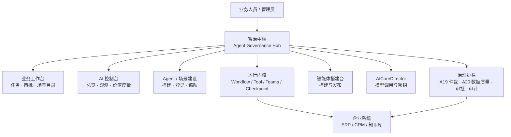

## 智治中枢：面向企事业单位的 AI 智能体服务及管控平台

**—— 郑州数能软件科技有限公司赋能企业 AI 生态建设的核心基础架构**

***

智治中枢的定位，不是又一个对话助手，而是面向企事业单位的 **「AI 智能体服务及管控平台」**：为企业 AI 生态提供可落地的核心基础架构。工作台与控制台面向企业全员，业务人员做事、管理人员管控，用的是同一套入口。

作为企业 AI 能力的 **编排与管控中枢**，它把多个智能体、业务规则与人工审批编排进同一工作流，并以「可编排、可治理、可审计」为硬约束——凡有 AI 参与的经营动作，都必须合规、可控、可追溯。由此，AI 才能真正嵌入经营、管理、生产等核心环节，逐步覆盖全业务场景，并支撑企业整体 AI 能力持续进化。

郑州数能软件科技有限公司（以下简称"数能软件"）推出的 **智治中枢（Agent Governance Hub）**，即按这一目标建设。

***

## 一、智能体进企业后，真正卡住的是什么

很多企业已经"上了 AI"：有的团队用现成助手写邮件，有的用编排工具搭了几个流程，有的把模型接到了报价或客服系统。表面热闹，内部却常常是这样：

*   **找不到**：谁也不清楚全公司到底有多少智能体、各自负责什么、现在能不能用
*   **管不住**：助手可以直接给结论，甚至推动业务动作，缺少岗位审批和数据质量门禁
*   **看不清**：一次协同跑了哪些步骤、依据哪条制度、谁批准的，事后无法复盘
*   **沉不下来**：Prompt、SOP、校核口径写在各项目里，下一个客户或下一条产线还得重做
*   **行业绑死**：为某一家工厂定制的 Agent，很难迁到另一家企业或另一个行业

这些问题的根因不是"模型不够强"，而是企业还在用 **聊天产品的方式** 使用智能体，而不是用 **业务服务的方式** 经营智能体。

聊天窗口解决的是"问得动"；业务服务要解决的是"申请得到、执行得完、责任留得住、结果写得回"。

***

## 二、数能软件的方案：把智能体做成企业服务

智治中枢的产品定位很明确：面向企事业单位的 **AI 智能体服务及管控平台**，也是企业 AI 能力的编排与管控中枢。它不是某个行业的专用套件，工作台与控制台面向企业全员。

对业务人员，它是工作台：用一句话发起任务，或从场景目录点选一项服务，跟踪执行，处理待办审批。

对建设人员，它是装配台：在 Studio 搭建智能体，登记或迁入能力，把多个智能体、业务规则与人工审批编进同一工作流。

对管理者，它是控制台：看已纳管 Agent、运行中任务、风险与人工介入、审计记录；必要时把企业切到只读分析或紧急停止。

一句话：

> 可编排、可治理、可审计：AI 参与的经营动作必须合规、可控、可追溯。



平台刻意把三件事拆开：

| 层级 | 产品 | 负责什么 | 不负责什么 |
|---|---|---|---|
| 治理与闭环 | 智治中枢 | 意图、目录、编队、门禁、审批、审计、写授权 | 不把落单权交给模型 |
| 智能运行 | 运行内核 | Workflow、工具调用、检索、记忆、评测 | 不拥有批准权 |
| 模型能力 | AICoreDirector | 多模型接入与调用 | 不直接写业务系统 |

Studio 则是能力生产线：搭建完成后点发布，可回调中枢自动登记；也可以从 Dify 等工具迁入定义，改由本平台托管运行。

***

## 三、产品怎么用：控制台、工作台、建设台

界面按企业真实分工分层，而不是把所有能力堆在一个"AI 聊天页"。

### 3.1 AI 控制台：先看见，再治理

总览、运行观测、价值度量。已纳管 Agent、运行中任务、风险/人工介入、审计记录，数字都来自平台实际记录，不用虚构经营数据。

控制台支持企业全局模式：正常运行、只读分析、紧急停止；也可以按企业隔离启停业务 Agent、场景和周期任务。平台治理节点 A19、A20 不可停用——这是设计，不是疏忽。

价值度量当前展示可被证明的治理运营指标：受控任务数、数据质量门禁拦截数、审批通过率、Skill 覆盖率、SLA 按时完成率、场景使用分布。节省金额、产能提升这类业务 ROI，必须在接入真实业务基线后再算，平台不会在缺少证据时编造收益。

### 3.2 业务工作台：做事、跟进、查资源

顺序按业务习惯排列：

1.  **我的任务**：左侧临时任务（含一句话发起），右侧周期计划
2.  **待我处理**：审批与人工检查点
3.  **执行追踪**：流程图 + 日志 + 节点详情
4.  **业务场景目录**：已发布服务，供业务发起
5.  **智能体资产**：只读能力一览，不是建设台

一句话任务会先做意图识别，再匹配已发布的服务目录。命中则按该场景的编队、SLA、审批人履行；未命中记为例外申请，仍可动态编排，但 **不会根据一句话自动长出一条新目录**。要固化成正式服务，必须到建设台发布场景。

### 3.3 Agent / 场景建设：从能力到服务

建设路径是固定的三步：

1.  **Agent 搭建台**：嵌入 Studio，把智能体画出来、跑起来
2.  **Agent 注册 / 迁入**：本平台直接搭建、Studio 发布同步，或从 Dify/其他工具迁入
3.  **组装场景**：拖拽编队、连线、发布；系统自动追加 A19 / A20

开启桥接后，Studio 里点「发布」会回调中枢自动登记或更新；修改后再发布，按同一来源更新台账，不另建一条。撤下发布则标记停用，历史 Trace 保留。

***

## 四、治理底座：企业能把智能体用进关键业务的前提

智治中枢把成熟的企业操作模型用在智能体协同上：服务目录、申请单与执行单、知识、审批与 SLA、受控集成、运营分析。运行内核负责建议、检索和受控工具；**批准和落单始终在中枢**。

### 4.1 场景即服务目录

已发布的业务场景就是 Catalog Item：名称、匹配词、变量、产出类型、SLA、审批人、履行编队，在组装时写死。发起时只填这一次的实例数据（客户、物料、吨数等），不能临时改规格。

这避免了两种常见失败：

*   每次口头描述都变成一次不可重复的"现场编排"
*   业务人员在发起时随意改审批人和编队，治理名存实亡

### 4.2 数据质量与协同仲裁

*   **A20 数据质量**：正常、警告、降级、暂停。降级状态禁止推动业务落单，无论人是否想"先出单再说"。
*   **A19 协同仲裁**：默认优先级为「安全 > 合规/信用 > 质量 > 交期 > 毛利/成本 > 能耗」。多 Agent 结论冲突时，按企业价值观裁决，而不是按谁先返回、谁模型更大。

### 4.3 人在回路，而不是人在旁边看

报价、合同、质量放行、停产停机等，只能由授权人员确认。发起任务时还可以在某个业务 Agent 之前设置执行中检查点：前序完成即暂停，授权人员看过上下文后再放行或终止。

放行意见进入后续上下文；人工节点、处理人、时间、意见和恢复后的 Trace 全部留痕。SLA 超时会标记待处理并写审计，**绝不自动批准**。

写回企业系统必须带审批签发的 `writeToken`。连接器默认只读；集成目录登记类型、方向和策略，不保存明文密码。

### 4.4 托管与外联：管得了运行，才管得了治理深度

| 类型 | 谁在跑 | 平台能管什么 |
|---|---|---|
| 托管型 | 本平台运行内核 | 编队、节点 Trace、知识/Skill、检查点、评测灰度、启停 |
| 外联型 | 远端 HTTP / MCP | 调用登记、边界摘要、结果门禁、审批、SLA |

知识与 Skill 只注入托管型。外联型不接收平台侧提示词，避免"以为管住了、其实在对方系统里自行其是"。混编场景里，托管节点走 Workflow，外联节点走边界调用，全部结果仍经 A20 / A19 / 人工审批后才可能写回。

***

## 五、能力如何沉淀：知识、Skill、受控演进

如果每个项目结束，Prompt 和口径又回到个人笔记本里，平台就只是更快的一次性交付工具。智治中枢把可复用单位做成三类资产。

**知识库。** 企业规章、SOP、合规条文按租户隔离导入；运行时按「租户 → 作用域 → 任务语义」检索，Trace 保留引用。知识首先写入中枢本地库，Studio 同步失败只告警、不阻断发布。

**运行时 Skill。** 适合做成 Skill 的是核验清单、口径、SOP、输出结构；禁止做成 Skill 的是 A19/A20、审批、租户隔离、密钥和业务写入。Skill 按「场景 × 智能体」匹配，发布须过评测，默认灰度后再全量，可回滚。

**受控自演进。** 不允许 Agent 自行改规矩。闭环为：

```text
反馈 / 驳回 → Fact → 待评审 → 批准 → Evaluator 评测 → 升版 → 灰度 → 二次评测后全量
```

绕过审批、修改治理节点、自动落单等指令会被评测拒绝。错误或过期的长期记忆可以撤回，并同步删除向量侧数据。

长期记忆只在任务经人工批准后压缩写入，并带来源任务编号。后续任务必须标注来源并重新核验，不能把记忆当成当前业务事实。

***

## 六、行业怎么复用：一套平台，多套行业参数

智治中枢内置制造业演示编队与十个场景，用来证明"智能体可以进入真实业务闭环"，而不是把产品做成钢铁专用系统。

| 场景 | 名称 | 默认审批角色 |
|---|---|---|
| S1 | 智能产线调度 | 生产主管 |
| S2 | 动态供应链优化 | 采购主管 |
| S3 | 智能质量协同管控 | 质量主管 |
| S4 | 智能设备维护 | 维修主管 |
| S5 | 能源优化管理 | 能源负责人 |
| S6 | 智能安全管理 | EHS 负责人 |
| S7 | 报价与合规校核 | 销售主管 |
| S8 | 合同签约与信用风控 | 法务/经管主管 |
| S9 | 经营洞察与制度协同 | 只读，不落单 |
| S10 | 售后投诉与履约闭环 | 售后主管 |

新企业的落地顺序通常是：

1.  建立隔离的企业空间，配置行业与角色
2.  登记连接器（先只读、先白名单）
3.  搭建或迁入本企业智能体
4.  按本企业审批岗位发布场景
5.  从只读分析跑通，再打开受控写回

汽车、电子、化工、装备与钢铁的差异，主要在数据对象、审批矩阵和连接器，而不在"再做一套智能体操作系统"。对软件公司 / ISV，这意味着：共性治理底座可以复用，行业差异用参数、编队和插件消化。

***

## 七、适合什么样的组织

**已经有若干智能体，但尚未形成企业级入口的中大型企业。**  
需要统一任务、审批、审计和启停，而不是再给每个部门一个聊天窗口。

**要把 AI 用进报价、质量、合同、停机等高责任动作的制造与装备企业。**  
必须有数据门禁、岗位审批和写授权，不能让模型直接改业务系统。

**需要为不同行业客户重复交付智能体方案的软件公司 / ISV。**  
需要把搭建、托管、迁入、场景发布做成产品能力，而不是每个项目从零写编排脚本。

**已经建设数据中台，下一步要补"智能层"的组织。**  
需要的是可申请的服务目录和可审计的执行，而不是又一套模型试用环境。

***

## 八、结语

大模型降低了"生成建议"的成本，但没有降低"对业务负责"的成本。企业缺的往往不是更多助手，而是一个能把助手变成服务的操作系统：

*   业务从目录申请，而不是从空白对话框碰运气
*   多智能体按编队协同，而不是单点聊天
*   风险动作必须经过质量门禁、价值仲裁和岗位审批
*   每次执行可追踪、可复盘、可改进，且改进本身也要过评测

这就是数能软件 **智治中枢** 要交付的能力。运行内核让智能体跑得起来，搭建台让能力造得出来，模型网关让推理接得进去；真正决定企业敢不敢把智能体用进关键业务的，是中枢这一层治理。

智能体进入企业的标志，不是又多了一个对话框，而是第一次有人能清楚回答：

> 这是哪一项服务、谁有权发起、依据什么执行、谁批准写回、下一次怎样比这一次更好。

***

**作者：** 郑州数能软件科技有限公司  
**产品：** 智治中枢（Agent Governance Hub）
