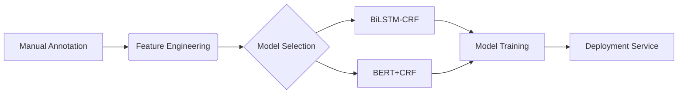
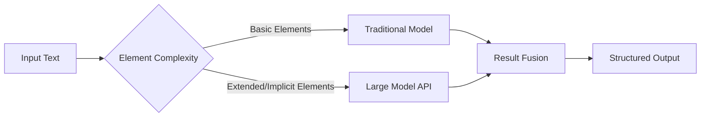

+++
date = '2025-08-06'
draft = false
title = 'Project Element Extraction: Traditional Machine Learning vs. Large Model Approaches - An In-depth Comparison'
description = "In vast information fields like engineering investment and international trade, **accurately extracting core project elements** (e.g., project name, investment amount, executing agency) is crucial for corporate decision-making. Traditional methods rely on supervised learning, while the advent of large models is revolutionizing this domain. Based on real business scenarios undertaken by our company, data annotation costs, technical implementation paths, and case comparisons, this article provides a deep analysis of the differences and selection strategies between these two technical routes."
categories = [
    "Large Model-based Structured Element Extraction",
]
tags = [
    "Structured Element Extraction",
    "Machine Learning Approach",
    "Large Model Technical Route",
    "Technical Route Selection Strategy"
]

+++
# Project Element Extraction: Traditional Machine Learning vs. Large Model Approaches - An In-depth Comparison

**——A Comprehensive Analysis Based on Real Business Scenarios from Our Company, Covering Annotation Costs, Generalization Capabilities, to Practical Results**


## I. Business Demand: Core Challenges in Project Element Extraction

### Target Element System

According to business documentation, structured data needs to be extracted from three types of texts:

1.  **Basic Elements** (10 categories)
    *   Project Name, Region, Executing Agency, Enterprise, Industry
    *   Investment Amount, Production Capacity, Cycle, Status, Foreign Country
2.  **Extended Elements** (20+ categories)
    *   Financing Entity, Trade Method, Technical Standards, Construction Cycle, etc.
    *   Covering the entire lifecycle (Signing → Construction → Commissioning → Financing)

### Text Type Complexity

*   Engineering News (e.g., "315MW Hydropower Station EPC Contract")
*   Trade Announcements (e.g., "High-Voltage DC Equipment Procurement")
*   Mineral Development (e.g., "Salt Lake Lithium Mine Construction Project")\
    **Challenges**: Dense professional terminology, variable sentence structures, scattered element distribution.

***


## II. Traditional Supervised Learning Approach: High-Cost Precision Models

### 1. Data Annotation: Labor-Intensive Work (Actual Annotation Sample Size)

| Category         | Annotation Sample Size |
| ---------------- | ---------------------- |
| Infrastructure Projects | 7,013                  |
| Investment Projects | 7,678                  |
| Trade Supply & Demand | 9,386                  |
| Investment Promotion | 6,381                  |

**Annotation Example**:

BIOE Sequence Labeling: (B-Beginning, I-Inside, E-End)

```plaintext
圭 亚 那 自 然 资 源 部  
B-COU I-COU E-COU O O O O  
```

> Annotating a "Foreign Country" requires precise segmentation of entity boundaries, taking approximately 3-5 minutes per sentence.

### 2. Model Construction Process



### 3. Core Bottlenecks

- **High Cost**: Annotating 10,000 data points ≈ 10 person-weeks, cost exceeding CNY 200,000.
- **Poor Generalization**: Changes in industry terminology (e.g., "converter valve equipment") require re-annotation.
- **Difficult to Extend**: Adding new elements (e.g., "financing purpose") requires a full process iteration.

## III. Large Model Approach: Prompt-Driven Zero-Shot Extraction

### 1. Paradigm Shift in Technology

**Traditional Method**: `Text → Model → Elements`
**Large Model Method**: `Text + Prompt → LLM → Structured JSON`

### 2. Core Advantages

- **Zero-Shot Startup**: Extract new elements without annotation.
- **Strong Semantic Understanding**: Parses "training hydropower industry workers" → Project Significance.
- **Multi-Task Compatibility**: Simultaneously supports element extraction + relationship extraction (e.g., "Owner-Contractor").

------

## IV. Practical Case Comparison: Traditional vs. Large Model

### Case 1: Indonesia 315MW Hydropower Project

#### Signed! EPC Contract for the 315MW Hydropower Project in Sulawesi, Indonesia

On May 16, a consortium formed by PowerChina International Group, CGGC International, and Guangxi Hydroelectric Investigation & Design Institute reached a cooperation consensus with Indonesia's Mandiri Group on the Sulawesi 315MW Hydropower Project in Indonesia and signed the project EPC contract with the owner's project company. This achievement drives the rolling development of Indonesia's clean energy market and accelerates Indonesia's progress towards its carbon neutrality goals.

The project is located in northern Sulawesi Island, Indonesia. It plans to install 7 axial-flow generating units, including 4 peak-shaving units and 3 run-of-river units, with a total installed capacity of approximately 315MW. The main structures include a concrete gravity dam, flood discharge structures, water diversion structures, and a powerhouse. Upon completion, the project will provide Sulawesi with stable clean energy, alleviate power shortages, empower the transformation of industrial parks on Sulawesi Island, Indonesia, and simultaneously train a group of hydropower industry workers. It sets a benchmark for high-quality co-construction of the "Belt and Road" and the "Regional Comprehensive Economic Corridor" between China and Indonesia, deepening bilateral production capacity cooperation.

Representatives from PowerChina International Group's Southeast Asia Regional Headquarters, PowerChina Indonesia Representative Office, CGGC Group Indonesia Representative Office, and Guangxi Hydroelectric Investigation & Design Institute Indonesia Representative Office attended the signing ceremony.

| **Element Type** | **Traditional Method Result**                  | **Large Model Result**                                       |
| :--------------- | :--------------------------------------------- | :----------------------------------------------------------- |
| Project Name     | ✅ Sulawesi 315MW Hydropower Project, Indonesia | ✅ Sulawesi 315MW Hydropower Project, Indonesia               |
| Country          | ✅ Indonesia                                    | ✅ Indonesia                                                  |
| Contractor       | ❌ Not Extracted                                | ✅ PowerChina International Group + CGGC + Guangxi Design Institute |
| Project Capacity | ❌ Not Extracted                                | ✅ Plans to install 7 axial-flow generating units, including 4 peak-shaving units and 3 run-of-river units, total installed capacity approx. 315MW |

> The large model can deeply understand its internal logic. Through semantic understanding, it extracts implied elements such as "Contractor" and "Project Capacity".

### Case 2: Chile KILO High-Voltage DC Project

#### CSG International Trade Company Signs Contract for Main Equipment Procurement of Converter Station for Chile KILO HVDC Transmission EPC Project

On May 5, Southern Power Grid International Trade (Guangzhou) Co., Ltd. (hereinafter referred to as "Trade Company") signed the main equipment procurement contract for the converter station of the Chile KILO High-Voltage Direct Current (HVDC) Transmission EPC Project with XD Power System Co., Ltd. and XD Transformer Co., Ltd. The contract value exceeds CNY 1 billion. Gong Tiansen, Deputy General Manager of CSG International Company, presided over the signing ceremony. The Chile KILO project is the first HVDC transmission project in Chile undertaken by CSG International Company as the consortium leader. The procurement and supply of main equipment for the converter station were undertaken by the Trade Company. As the international trade platform of China Southern Power Grid Company, the Trade Company actively cooperated closely with the Chile KILO Converter Station EPC Project Department, CSG Research Institute, CSG Supply Chain Group, and other units. Based on the contract technical specifications of the Chilean owner, they continuously optimized the equipment procurement plan, shortened response times, and procured 21 converter transformers and a batch of converter valves and valve hall equipment, as well as water cooling systems through the CSG Supply Chain Procurement Platform, completing this major milestone task for the main equipment procurement of the Chile KILO project converter station on schedule. The Trade Company has always adhered to the guidance of "accelerating the construction of a new development pattern and striving to promote high-quality development," planning the high-quality development of the trade sector of CSG International Company. By focusing on serving its core responsibilities and main businesses, it strives to provide timely, professional, and efficient one-stop equipment and material procurement and supply services for overseas projects, making due contributions to promoting the "going global" of advanced Chinese standards, technologies, equipment, and brands.

| **Key Difference** | Traditional Method                                           | Large Model                      |
| :----------------- | :----------------------------------------------------------- | :------------------------------- |
| Contract Amount    | ❌ Assigned value to "Planned Investment Amount" (Contract amount should not be confused with planned investment amount) | ✅ Exceeds CNY 1 billion          |
| Signing Date       | ❌ Not Identified                                             | ✅ May 5, 2023                    |
| Project Type       | ❌ Not Identified                                             | ✅ Equipment Procurement Contract |

> The large model achieves higher accuracy and recall rates in extraction. It can more accurately identify and extract key information such as contract amount, signing date, and project type.
> It is incorrect for the traditional method to assign this amount to "Planned Investment Amount." The contract amount is not equivalent to the planned investment amount; the contract amount refers to the specific amount for procurement or contract signing.


### Case 3: Argentina Lithium Project

#### Construction Commences on C233 Section of Argentina's Centenario Salt Lake Project

Recently, construction commenced on the C233 Installation Section of the Argentina Centenario Salt Lake Lithium Mine project, signed by PowerChina International and entrusted to Sinohydro Bureau 10 for implementation. Representatives from Eramet Group's South American subsidiary, Lafa Construction Company, and Sinohydro Bureau 10 attended the ceremony.

The C233 installation section is the fifth section undertaken by Sinohydro Bureau 10, following Sections C201, C217, 2200, and 2300. It is located in the Ratones Salt Lake in the Andes Mountains within the Salta province in northwest Argentina, known as the "South American Lithium Triangle," at an altitude of approximately 4,100 meters and about 370 kilometers from Salta City. The project duration is 300 days, and the main construction content includes the installation of steel structure workshops, mechanical equipment, and pipelines. The smooth progress of the various sections of the Argentina Centenario Salt Lake Lithium Mine project has accumulated valuable experience for Sinohydro Bureau 10's mining business to accelerate transformation and upgrading under the background of carbon peak and carbon neutrality.

Argentina's total lithium resource reserves are approximately 1.8 billion tons, of which proven reserves are 1 billion tons, making it the world's third-largest lithium metal reserve country. In recent years, with the rapid development of the global new energy vehicle industry, downstream lithium battery industry demand has increased significantly. Since China and Argentina signed cooperation documents such as the Memorandum of Understanding on Co-constructing the "Belt and Road," lithium industry cooperation has gradually become a highlight of China-Argentina new energy cooperation. The signing of this project is the result of PowerChina's deep cultivation of the Argentine market, focusing on the development of the country's key industries, and continuously consolidating brand advantages. It helps elevate China-Argentina co-construction of the "Belt and Road" to new levels.

**Large Model Deep Understanding Capability**:

json

```
{
  "Detailed Address": "Project located in the Ratones Salt Lake, Andes Mountains, at an altitude of approximately 4,100 meters",
  "Project Background": "Argentina's total lithium resource reserves are approximately 1.8 billion tons, making it the world's third-largest lithium metal reserve country. In recent years, with the rapid development of the global new energy vehicle industry, downstream lithium battery industry demand has increased significantly. Lithium industry cooperation has gradually become a highlight of China-Argentina new energy cooperation.",
  "Project Significance": "The signing of this project is the result of PowerChina's deep cultivation of the Argentine market, focusing on the development of the country's key industries, and continuously consolidating brand advantages. It helps elevate China-Argentina co-construction of the 'Belt and Road' to new levels."
}
```

> Compared to traditional models relying on predefined short labels for data annotation, large models possess stronger semantic understanding and contextual capture capabilities, enabling accurate extraction of unstructured information requiring long-text comprehension, such as "Project Background" and "Project Significance."

## V. Methodology Comparison Panorama

| **Dimension**               | **Traditional Supervised Learning**                   | **Large Model Approach**                      |
| :-------------------------- | :---------------------------------------------------- | :-------------------------------------------- |
| Data Dependency             | Strongly dependent on thousands of annotated samples  | Zero-shot/Few-shot startup                    |
| Deployment Cost             | Annotation + Training + Tuning ≥ 3 weeks              | API call, immediate effect                    |
| Element Extensibility       | Adding new elements requires re-annotation & training | Modify Prompt to extend                       |
| Fine-Grained Parsing        | ✅ Precise entity boundaries                           | ⚠️ Occasional over-generation                  |
| Implicit Information Mining | ❌ Limited                                             | ✅ Deep association of background/significance |
| Industry Migration Cost     | High (Requires new annotation)                        | Low (Generic knowledge transfer)              |

------

## VI. How to Choose the Technical Route?

### Recommended Strategy: **Hybrid Architecture**



### Scenario-Specific Advice:

1. **High-Precision Critical Scenarios** (Contract Parsing)
   - Traditional model guarantees 95%+ accuracy for core elements.
   - Large model supplements background information.
2. **Rapid Response Needs** (Emerging Industry Monitoring)
   - Large model enables zero-shot extraction, deployment within 48 hours.
3. **Cost-Sensitive Scenarios**
   - Traditional model handles 80% of high-frequency elements.
   - Large model handles long-tail demands.

------

## VII. Future Evolution Directions

1. **Large Model Distillation**
   - Distill knowledge from models like DeepSeek-R1 into lightweight specialized models, balancing effectiveness and cost.
2. **Dynamic Prompt Optimization**
   - Automatically switch Prompt templates based on text type (Engineering/Trade/Mining).
3. **Error Correction Feedback Mechanism**
   - Use manual correction results to inversely train traditional models, forming a closed loop.

> **Key Conclusion**: Large models are not replacing traditional methods but liberating them from the "annotation quagmire," shifting towards an **intelligence-augmented paradigm of human-machine collaboration**.

------

**Note**: This article is based on analysis of real project documents. Technical comparison conclusions were validated through actual testing of BERT/BiLSTM-CRF and GPT-4.
[file content end]


Here is an actual project interface screenshot.


